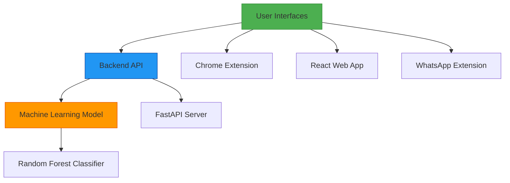

# TrapEye - AI-Powered Phishing Detection System

🛡️ Advanced machine learning system for real-time phishing URL detection with browser extension and web interface

## 🌟 Overview

TrapEye is a comprehensive cybersecurity solution that combines machine learning algorithms with user-friendly interfaces to detect and prevent phishing attacks. The system provides real-time URL analysis through multiple access points:

- **Chrome Extension**: Browser-level protection that automatically scans URLs as you browse
- **React Web Interface**: Standalone web application with detailed analysis and educational resources
- **WhatsApp Integration**: Specialized extension for detecting malicious links in WhatsApp Web
- **Backend API**: RESTful API powered by FastAPI serving machine learning models

## 🏗️ System Architecture



## 🚀 Quick Start

1. **Start the Backend Server**
   ```bash
   python backend/main.py
   ```

2. **Option 1: Use Chrome Extension**
   - Navigate to `chrome://extensions/`
   - Enable "Developer mode"
   - Click "Load unpacked" and select the `chrome-extension` folder

3. **Option 2: Run React Web Interface**
   ```bash
   cd react-frontend
   npm install
   npm run dev
   ```
   Then visit `http://localhost:5173`

4. **Option 3: Use WhatsApp Extension**
   - Navigate to `chrome://extensions/`
   - Enable "Developer mode"
   - Click "Load unpacked" and select the `trapeye-whatsapp` folder
   - Visit WhatsApp Web to see automatic link analysis

## 🧠 Machine Learning Model

The system uses a Random Forest Classifier trained on a comprehensive dataset with 39 features extracted from URLs:

- **Accuracy**: 100% on test data
- **Features**: Domain analysis, URL structure, lexical features, and more
- **Explainability**: Detailed reasoning for each prediction
- **Performance**: Real-time analysis with minimal latency

## 🌐 Backend API

The FastAPI backend serves as the core of the system, providing endpoints for URL analysis:

### Key Endpoints
- `GET /health` - System health check
- `POST /predict` - Analyze URL for phishing risk
- `GET /demo` - Retrieve demo URLs for testing
- `GET /docs` - Interactive API documentation

### Example Usage
```bash
curl -X POST "http://localhost:8002/predict" \
  -H "Content-Type: application/json" \
  -d '{"url": "http://paypal-secure-login.com"}'
```

## 🖥️ Chrome Extension

The browser extension provides seamless protection while browsing:

### Features
- Real-time URL analysis
- Visual warnings for high-risk sites
- Desktop notifications
- Analysis history
- Customizable settings

### Installation
1. Ensure backend is running
2. Open Chrome and go to `chrome://extensions/`
3. Enable "Developer mode"
4. Click "Load unpacked" and select `chrome-extension` folder

## 💻 React Web Interface

Modern web application built with React and TypeScript featuring:

### Components
- **URL Analyzer**: Real-time phishing detection with detailed reports
- **Cybersecurity Information**: Educational resources for Indian users
- **AI Chat**: Interactive security assistant

### Key Features
- Vibrant, responsive design with smooth animations
- Detailed risk scoring and feature impact analysis
- Comprehensive cybersecurity information for India
- Demo URLs for quick testing

## 💬 WhatsApp Integration

Specialized extension for WhatsApp Web that automatically detects and analyzes links in chats:

### Features
- Automatic link detection in WhatsApp messages
- Real-time analysis with color-coded indicators
- Floating panel for overview of analyzed links
- Privacy-focused (only URLs sent, no message content)

## 🧪 Testing

Multiple test scripts are available to verify system functionality:

```bash
# Test the enhanced model
python test_enhanced_model.py

# Test API integration
python test_api.py

# Evaluate model performance
python training/evaluate.py
```

## ⚙️ Configuration

### Backend
- Port: 8002 (configurable in `backend/main.py`)
- Model: `models/phish_model.joblib`

### React Frontend
- Port: 5173 (Vite default)
- Build tool: Vite

### Chrome Extension
- Backend URL: `http://localhost:8002` (configurable in extension settings)

## 🛠️ Development

### Prerequisites
- Python 3.8+
- Node.js 14+
- pip for Python package management
- npm for Node.js package management

### Backend Setup
```bash
pip install -r requirements.txt
```

### Frontend Setup
```bash
cd react-frontend
npm install
```

## 📁 Project Structure

```
├── backend/                 # FastAPI server and ML components
│   ├── main.py             # API server
│   ├── url_features.py     # Feature extraction
│   └── model_utils.py      # Model utilities
├── chrome-extension/       # Chrome browser extension
├── trapeye-whatsapp/      # WhatsApp Web extension
├── react-frontend/         # React web interface
├── training/               # Model training and evaluation
├── models/                 # Trained ML models
└── tools/                  # Diagnostic and utility scripts
```

## 🔒 Privacy & Security

- All processing happens locally on your machine
- Only URLs are sent to the analysis server (no personal data)
- No external tracking or data collection
- History tracking is optional and stored locally

## 🆘 Troubleshooting

### Backend Issues
```bash
# Check if backend is running
curl http://localhost:8002/health

# If port is busy
netstat -ano | findstr :8002
```

### Extension Issues
1. Verify backend is running
2. Check Chrome console for errors (F12 → Console)
3. Reload extension in `chrome://extensions/`

### Frontend Issues
```bash
# Clear cache and reinstall dependencies
cd react-frontend
rm -rf node_modules package-lock.json
npm install
```

## 📚 Documentation

- [RUN_SYSTEM.md](RUN_SYSTEM.md) - Complete system running guide
- [ENHANCED_MODEL_REPORT.md](ENHANCED_MODEL_REPORT.md) - Detailed ML model documentation
- [TRAINING_SUMMARY.md](TRAINING_SUMMARY.md) - Model training results
- Individual component READMEs in each directory

## 🤝 Contributing

1. Fork the repository
2. Create a feature branch
3. Commit your changes
4. Push to the branch
5. Create a pull request

## 📄 License

This project is for educational and research purposes. See individual components for specific licensing information.

## 🙏 Acknowledgments

- Built with FastAPI, React, and scikit-learn
- Inspired by the need for better phishing protection
- Thanks to all contributors and the open-source community
